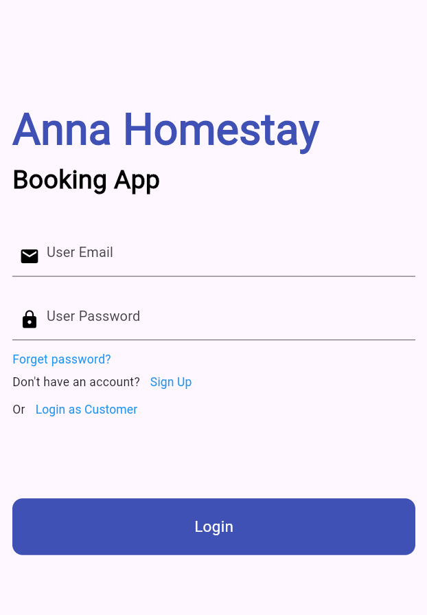
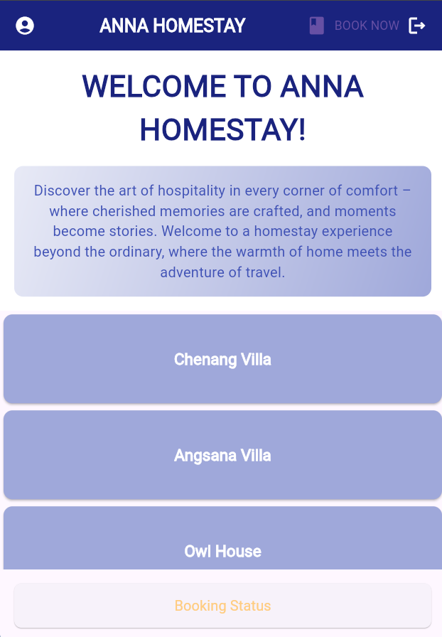
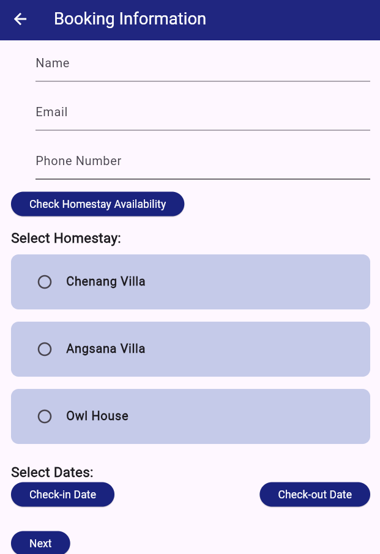
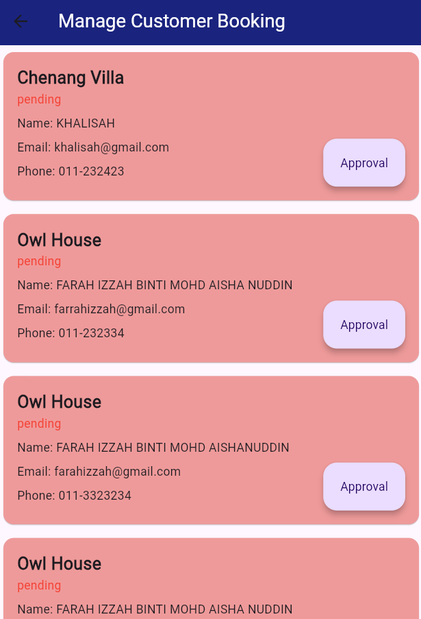

# annahomestay

- Developed a cross-platform homestay booking app using Flutter framework.
- Integrated Firebase for backend services, including user authentication, real-time database management, and booking functionalities.

## Some UI

